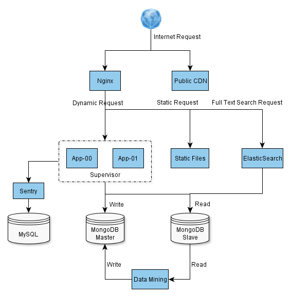
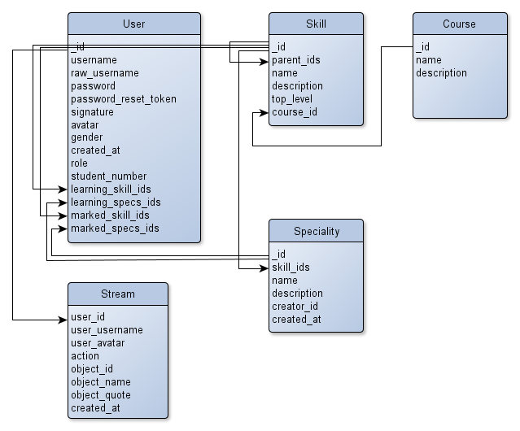
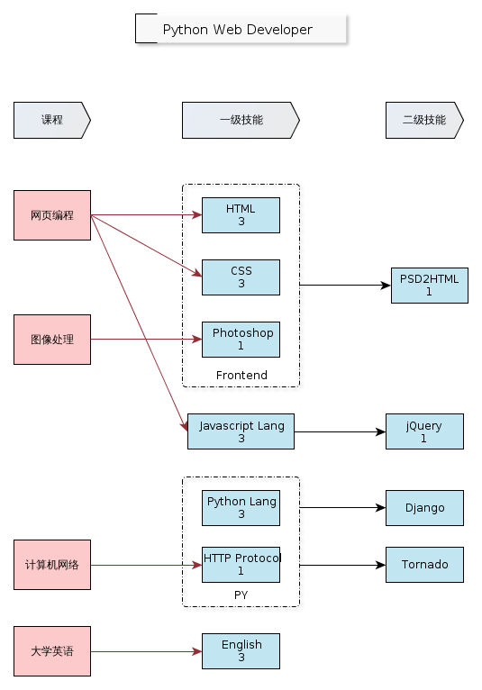
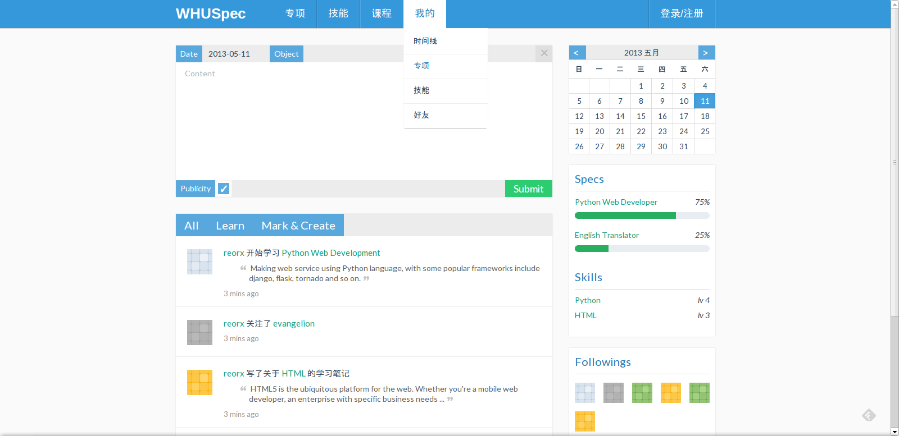
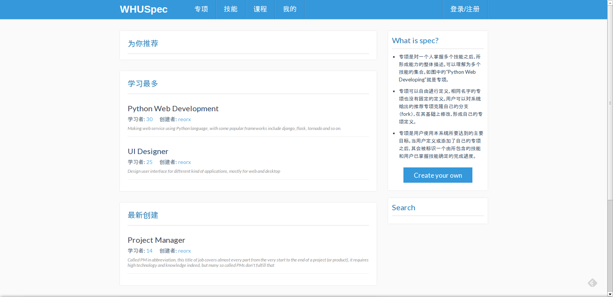

WHU Speciality
==============

    My graduation project.

Help student improve their ability by recommending organized skill trees (called speciality) and relevant courses through this web application.

Diagrams
--------

**System Architecture**

**Entity Relationship**

**Spec Hierarchy**

User Interface
--------------

**Home Page**

**Spec Page**

References
----------

Flat-UI: `github.com/designmodo/Flat-UI <http://github.com/designmodo/Flat-UI>`_

    commit 09314bc57221a1184398cf93d56f0c03ac53f6f5

